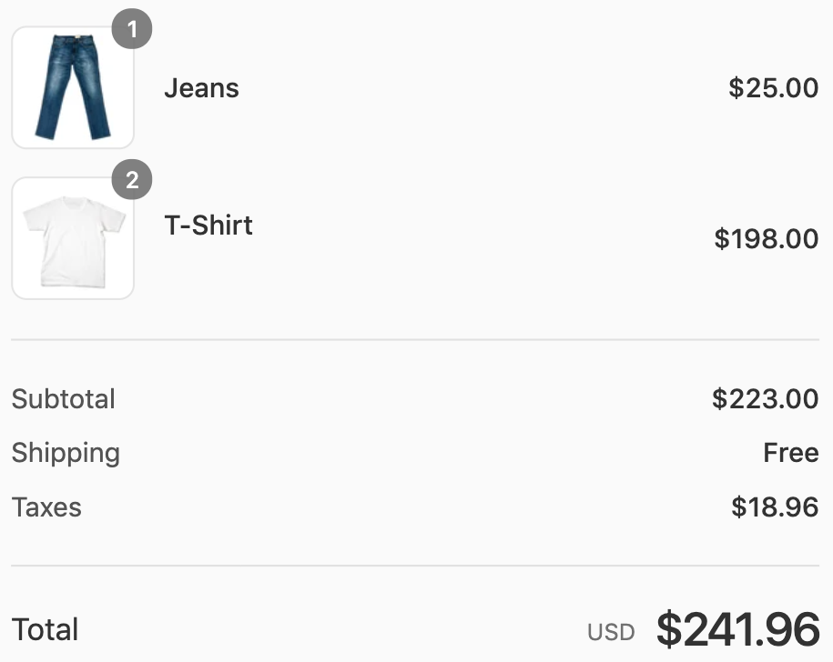
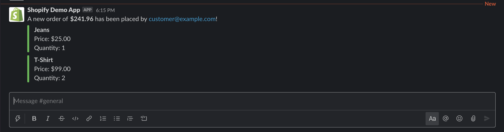

# Shopify New Order Slack Bot

## Project Overview

This project contains an example of how to setup a Slack bot to send you messages whenever a new order is created in your Shopify Store. It uses the Shopify `orders.create` Event Source and [slack.channels.messages.create](https://autocode.com/stdlib/slack/channels/#messages-create) API from Autocode's Standard Library. You can deploy your own working version of this project in just a few clicks with Autocode.

Click the button above to open this project in Autocode, and link your Shopify Store and Slack Workspace (follow the recommended Slack App flow) to your project in Autocode and deploy!

Like all Autocode Sources, the endpoints and whatever data you want to include/format in your Slack message from the event source are completely customizable in this project –– everything is code that you can edit and test using the Autocode editor.

## Endpoints

This endpoint will get triggered on the event where a new order is created in your Shopify Store.

### functions/events/shopify/orders/create.js

Once the endpoint is trigged, it extracts the total price paid for the order, the customer's email, and loops through the line items formatting them and calls the the Slack endpoint with that data to send a message to the `#general` channel.

## Thank You!

Please check out [Autocode](https://autocode.com) or follow us on Twitter, [@AutocodeHQ](https://twitter.com/AutocodeHQ).
